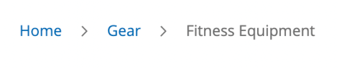

# Adobe Commerce Frontend Development - Chapter 11
Commonly Used Libraries Bundled with Adobe Commerce
---
This folder contains all scripts, code, and solutions for the practical exercises described in Chapter 11 of our Frontend Development Book.

## Folder Structure
- **`code` folder:** Contains directly copyable files to your local instance, identical to the book's code examples. Remember to also copy the `dev` folder for the necessary `themes.js` file for Grunt CSS compilation.
- **`solutions` folder:** Offers solutions to Chapter 11's practical exercises. Attempt the exercises first before referring to these solutions for code validation.

## Important Notes
- **For Linux / WSL / OSX Users:** Ensure all files are synced with your `warden` environment.

## Installing a Required Modules

Enable modules: `PacktPub_FrontendCourse`, `PacktPub_JavaScriptPlayground` with the following steps:
1. Copy `app/code/PacktPub` to your project's corresponding directory (`app/code`).
2. Enter your `warden` container: `warden shell`.
3. Enable modules, if you haven't already,: `php bin/magento mod:enable PacktPub_FrontendCourse PacktPub_JavaScriptPlayground`.
4. Run upgrade command `php bin/magento setup:upgrade`
5. Clear the cache: `php bin/magento cache:flush`.
---

### Verification
- Confirm the module's activation in `app/etc/config.php`.

or
- Run `php bin/magento module:status` in your app container.

---
## Solutions to Practical Exercises:

All code solutions to exercises in Chapter 11 are all in `XML` files and are marked with an XML comment, like this:
```xml
<!-- solution to exercise XX -->
    <layout>
        [...]
    </layout>
<!-- /end solution -->
```

for **template** files it is also an HTML comment
```html
<!-- solution to exercise XX -->
    <p>[...]</p>
<!-- /end solution -->
```

for **less** files it is also an HTML comment
```less
/* <!-- Exercise XX, Chapter 11 --> */
    body {
      [...]
    }
/* <!-- /end exercise --> */
```

for **JavaScript** files it is also an HTML comment
```less
<!-- Exercise XX, Chapter 11 -->
define([
   ...
]);
<!-- /end exercise -->
```

where `XX` is the number of the exercise

### Important:
* Please check and pay attention how changes are related to module related directories.
* Disable Client Side CSS Compilation, use server side

---
### Practical Exercises
1. Add a new block on a product page that will show a calendar widget and allow the user to
select a date.
2. Add a new tab on a product page and a MediaUploader widget inside the tab.
3. Modify the breadcrumb widget to show a home icon instead of the Home link. Do this by
   modifying the breadcrumbs.js widget: \
    
4. On the checkout page, change the behavior of the summary block and make sure it implements
   the Sticky widget so it stays with the user when they scroll on the checkout page.