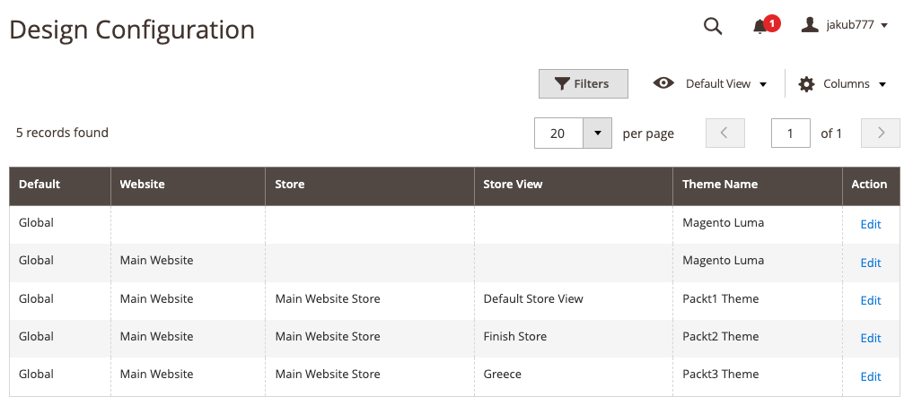

# Exercise 4, Solution

## Step-by-Step Guide

---
1. Login to Admin Panel
2. Proceed to Content -> Design -> Configuration Section

3. Edit a desired store
4. Locate `HTML Head` section

5. Enter **Page Title Prefix**
6. ENter **Page Title Suffix**
7. Save Configuration

