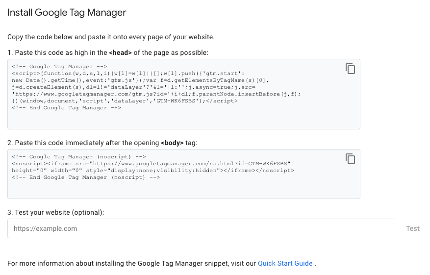
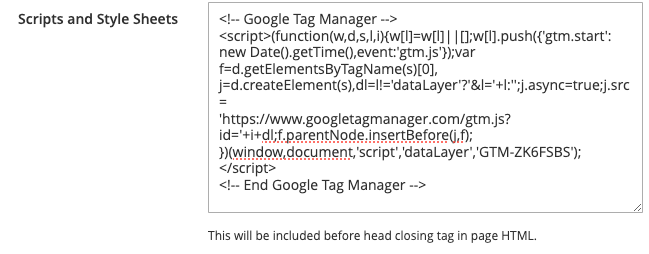

# Exercise 5, Chapter 12

## Step-by-Step Guide

---
1. Login to Admin Panel
2. Create a Google Tag Manager Account at https://tagmanager.google.com/
3. Grab the Scripts from Google Tag Manager:

4. Proceed to Content -> Design -> Configuration Section

5. Edit a desired store
6. Locate `Scripts and Style Sheets` section
7. Copy data from GTM 1st part, **head**, to the `input` field

8. Save Configuration

