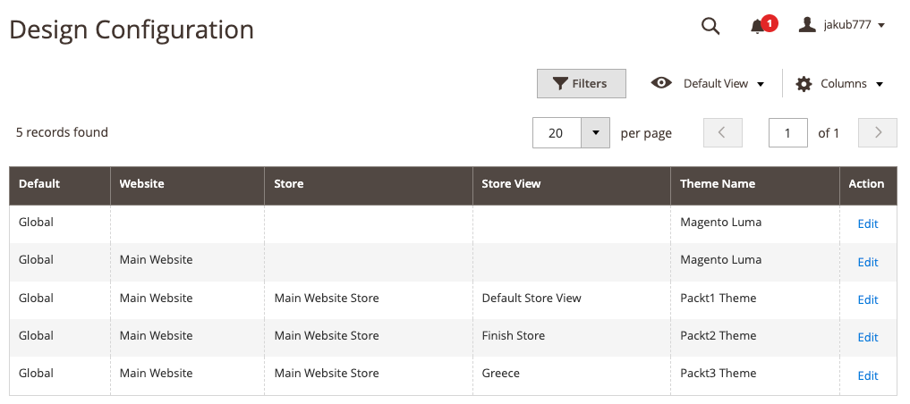
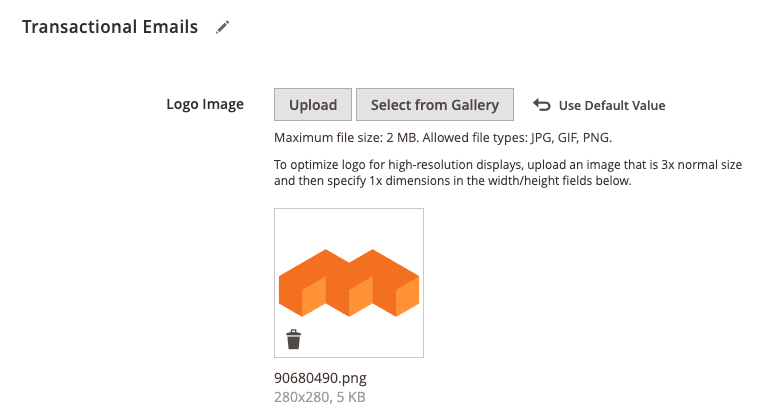

# Exercise 6, Chapter 12

## Step-by-Step Guide

---
1. Login to Admin Panel
2. Proceed to Content -> Design -> Configuration Section

3. Edit a desired store
4. Locate `Transactional Emails` section
5. Upload a custom Logo 

7. Save Configuration

