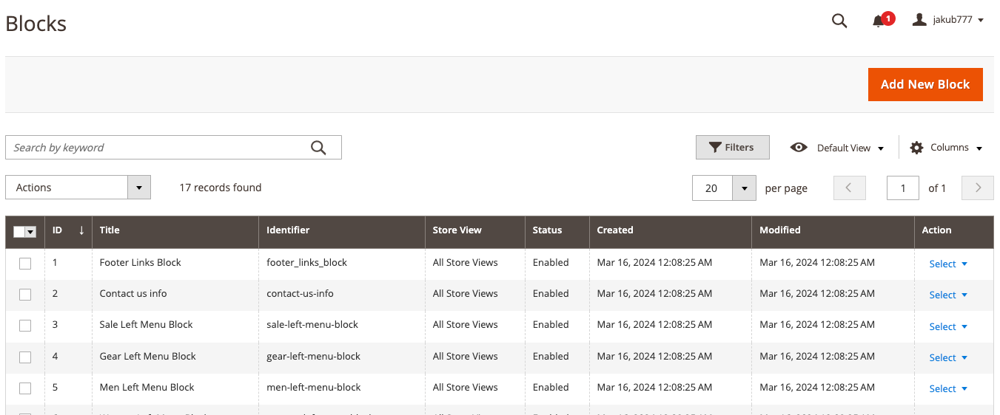
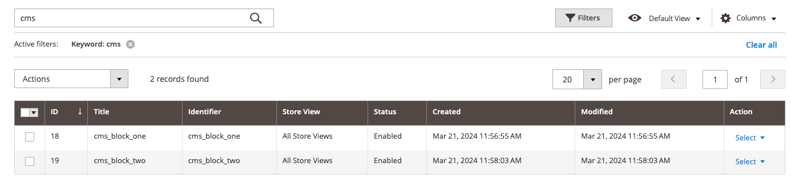

# Exercise 1, Chapter 13 - Solution

## Step-by-Step Guide

---
1. Login to Admin Panel
2. Proceed to Content -> Elements -> Blocks



3. Add 2 new CMS Blocks, set identifiers `cms_block_one` and `cms_block_two`


You should have blocks like this:


4. Create `catalog_product_view.xml` Layout XML inside your theme
5. Inject CMS blocks into proper containers / blocks, do it for both blocks

```xml
    <block class="Magento\Cms\Block\Block" name="cms.block.one">
        <arguments>
            <argument name="block_id" xsi:type="string">cms_block_one</argument>
        </arguments>
    </block>
```

6. You should see the CMS Blocks on the page