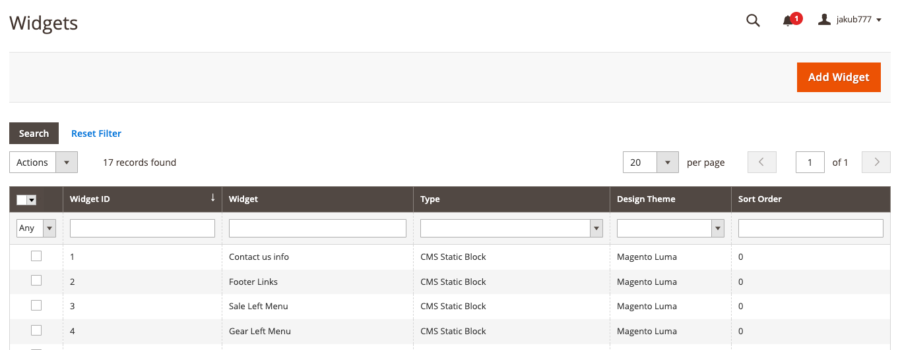
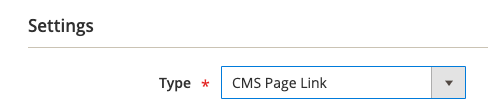
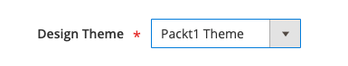
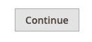
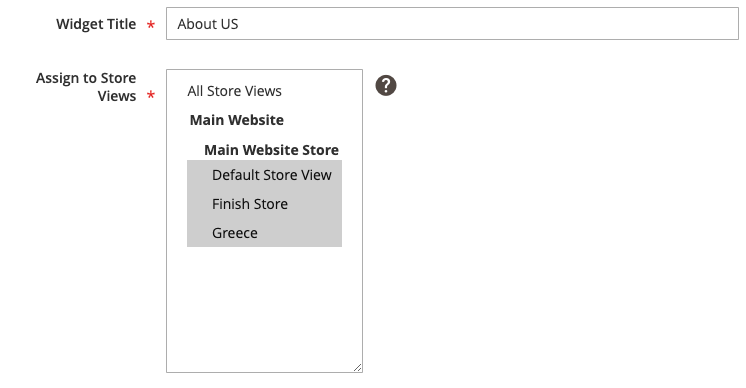
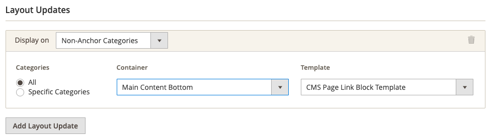
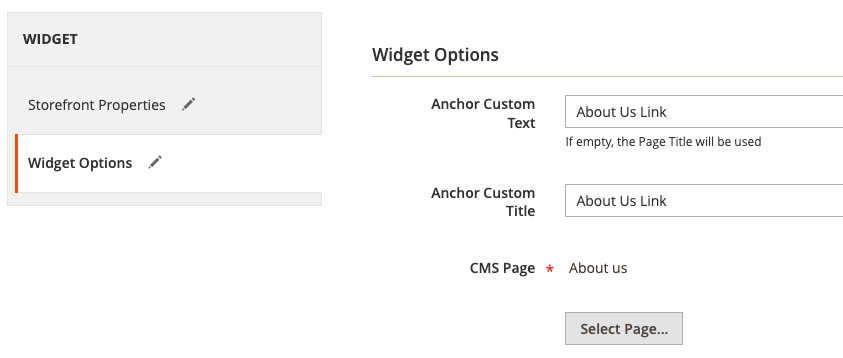

# Exercise 3, Chapter 13 - Solution

## Step-by-Step Guide

---
1. Login to Admin Panel
2. Proceed to Content -> Widgets

3. Click "Add Widget"

4. Select a proper Widget Type:

5. Select theme (`packt1`)

6. Click **Continue**

it will load widget settings

7. Assign Widget to Store Views:

8. Set Proper Container by adding Layout Update (page without filters):

9. Select **Widget Options** tab and select the CMS Page in the widget options:

