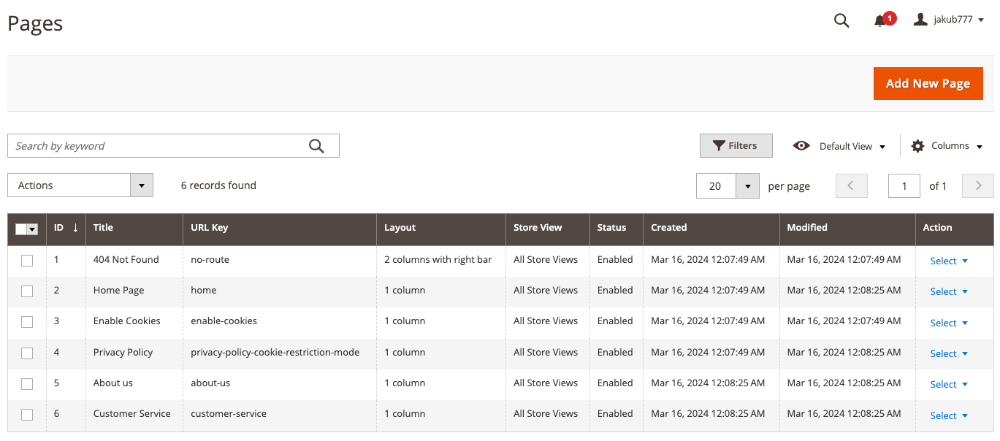

# Exercise 4, Chapter 13 - Solution

## Step-by-Step Guide

---
1. Login to Admin Panel
2. Proceed to Content -> Element -> Pages

3. Add new page and set the design to 3 columns:

4. Create a new Widget: Recently Viewed Products:

5. Create a new Widget: Compared Product Lists:

