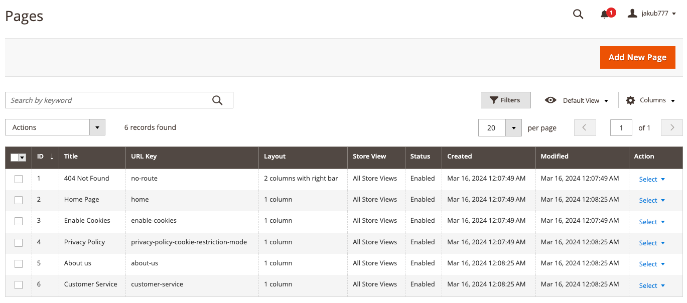
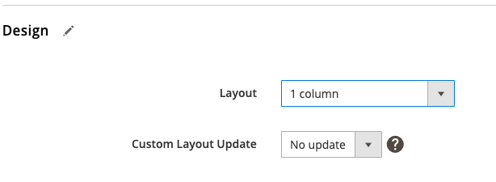
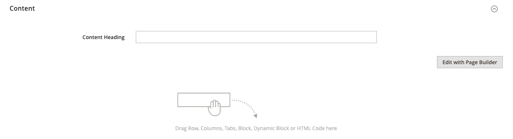
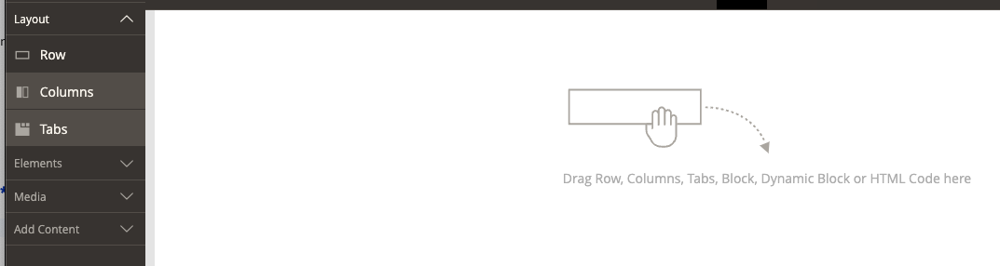
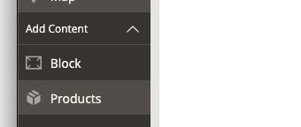
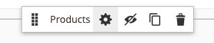
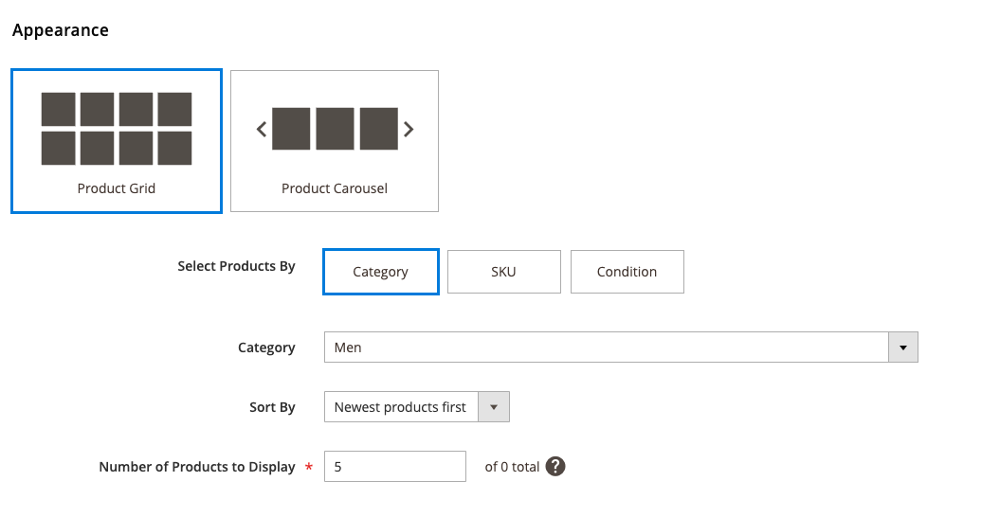
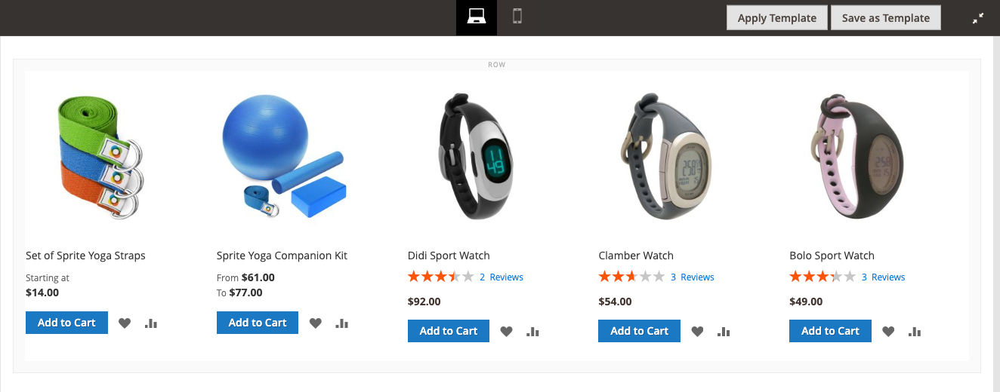

# Exercise 4, Chapter 13 - Solution

## Step-by-Step Guide

---
1. Login to Admin Panel
2. Proceed to Content -> Element -> Pages

3. Add new page and set the design to 1 column:

4. Go to **Content** section

5. Click **Edit With PageBuilder**

6. Drag row into `Content` Section:

7. Drag **Products** to the `Row` Content:

8. Click `COG` icon to configure product listing:

9. Configure the Widget

10. Close Page buidler by clicking top right corner icon:

11. Save CMS Page

