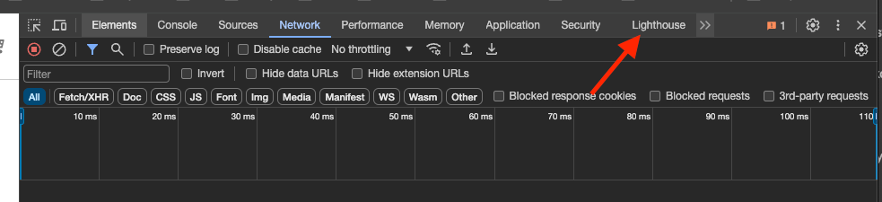
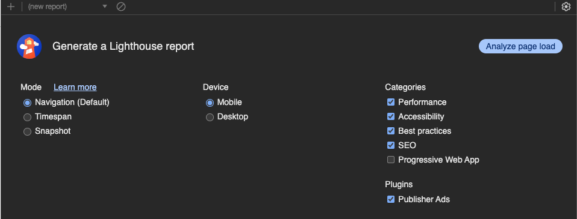
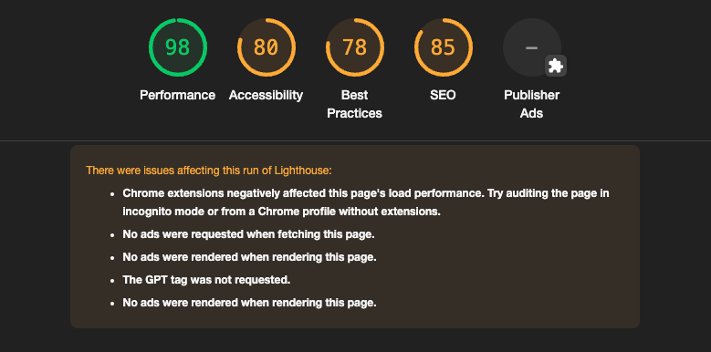

# Exercise 1, Chapter 14 - Solution

## Step-by-Step Guide

You will find all details on official Google Page:
https://developer.chrome.com/docs/devtools

---
1. Install Google Chrome / Brave, or any other web-browser based on Chrome
2. Open Chrome DevTools
3. Proceed to Lighthouse Section:

4. Scan the site for mobile devices (default settings)

5. Results are ready (MagePack was used to render this screenshot)

