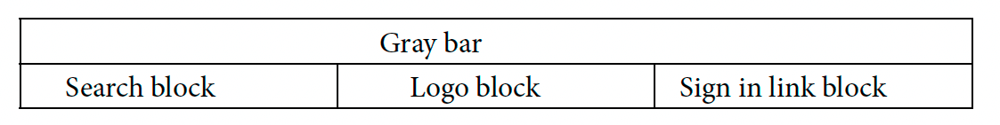

# Adobe Commerce Frontend Development - Chapter 5
Working with Templates
---
This folder contains all scripts, code, and solutions for the practical exercises described in Chapter 5 of our Frontend Development Book.

## Folder Structure
- **`code` folder:** Contains directly copyable files to your local instance, identical to the book's code examples. Remember to also copy the `dev` folder for the necessary `themes.js` file for Grunt CSS compilation.
- **`solutions` folder:** Offers solutions to Chapter 4's practical exercises. Attempt the exercises first before referring to these solutions for code validation.

## Important Notes
- **For Linux / WSL / OSX Users:** Ensure all files are synced with your `warden` environment.

## Installing a Required Module
Enable the `PacktPub_FrontendCourse` module with the following steps:
1. Copy `app/code/PacktPub` to your project's corresponding directory.
2. Enter your `warden` container: `warden shell`.
3. Enable the module: `php bin/magento mod:enable PacktPub_FrontendCourse`.
4. Clear the cache: `php bin/magento cache:flush`.

### Verification
- Confirm the module's activation in `app/etc/config.php`.

or
- Run `php bin/magento module:status` in your app container.

## Template and Blocks
Find practical Layout XML usage examples within the `code/app/design` folder, showcasing 2 themes as discussed in Chapter 5.

---
## Solutions to Practical Exercises:

All code solutions to exercises in Chapter 4 are all in `XML` files and are marked with an XML comment, like this:
```xml
<!-- solution to exercise XX -->
    <layout>
        [...]
    </layout>
<!-- /end solution -->
```

for **template** files it is also an HTML comment
```html
<!-- solution to exercise XX -->
    <p>[...]</p>
<!-- /end solution -->
```

where `XX` is the number of the exercise

### Important:
Please check and pay attention how changes are related to module related directories.


### Few notes:
* **Chapter 6** is about CSS changes so you might notice few less files that you have not used before, in practical solutions

---
### Practical Exercises:
1. Change the template of the customer registration page to two columns and move the entire
   registration form to the left column, placing a random block with a template inside the right
   column with an image inside it.
2. Change the main page header (below the dark gray bar) into a three-column grid and make
   the following changes:
   * Move the search bar to the left column
   * Move the logo to the middle column
   * Move the “sign in” element into the right column
   * should look like this:
    
   * Assign each block a new template in your theme.
3.  By using Layout XML, move the newsletter sign up block above the footer links and assign it
     a new template inside your theme directory.
4. Remove the Add to wishlist and Add to compare links from a product page by modifying
   a template.
5. Remove SKU from a product page.
6. On the shopping cart page, after adding a few items to the shopping cart, move the Apply
   Discount Code block to the right column below the Summary block.
7. Change the template for a product list on a catalog search page only and do the following:
   * Move the product name to the top.
   * Remove all icons and the add to cart button from the product tiles.
8. Customer login page:
   * Assign the entire form a new template inside your theme and remove the text, “If you
      have an account, sign in with your email address.”
   * Change the template used for the registration block so as only to show the Create an
      Account button and place it below the Sign in button.
9. Page Footer:
   * Create four columns in the page footer using containers.
   * Place a block inside each container and set the same template for each block, but use
   Layout XML to pass a text (string) argument into a block and render it in each column.
10. Mini Cart (visible on click if you have items in your shopping cart):
     Move the Proceed to Checkout button to the bottom of the popup
11. Move the Currency Switcher (page header) block to the bottom right corner of the page and
    display all currencies with proper links. Change the dropdown element into a table, with the
    first row of the table being a selected currency.
