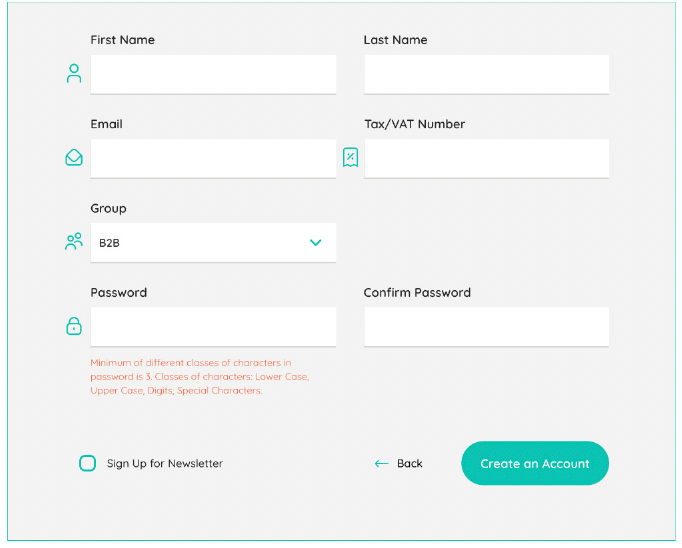

# Adobe Commerce Frontend Development - Chapter 6
Styling an Adobe Commerce Theme
---
This folder contains all scripts, code, and solutions for the practical exercises described in Chapter 6 of our Frontend Development Book.

## Folder Structure
- **`code` folder:** Contains directly copyable files to your local instance, identical to the book's code examples. Remember to also copy the `dev` folder for the necessary `themes.js` file for Grunt CSS compilation.
- **`solutions` folder:** Offers solutions to Chapter 4's practical exercises. Attempt the exercises first before referring to these solutions for code validation.

## Important Notes
- **For Linux / WSL / OSX Users:** Ensure all files are synced with your `warden` environment.

## Installing a Required Module
Enable the `PacktPub_FrontendCourse` module with the following steps:
1. Copy `app/code/PacktPub` to your project's corresponding directory.
2. Enter your `warden` container: `warden shell`.
3. Enable the module: `php bin/magento mod:enable PacktPub_FrontendCourse`.
4. Clear the cache: `php bin/magento cache:flush`.

### Verification
- Confirm the module's activation in `app/etc/config.php`.

or
- Run `php bin/magento module:status` in your app container.

---
## Solutions to Practical Exercises:

All code solutions to exercises in Chapter 4 are all in `XML` files and are marked with an XML comment, like this:
```xml
<!-- solution to exercise XX -->
    <layout>
        [...]
    </layout>
<!-- /end solution -->
```

for **template** files it is also an HTML comment
```html
<!-- solution to exercise XX -->
    <p>[...]</p>
<!-- /end solution -->
```

where `XX` is the number of the exercise

### Important:
Please check and pay attention how changes are related to module related directories.


### Few notes:
* **Chapter 6** is about CSS creation, but for practical solutions we will work with `Layout XML` and `Template` files. So you might notice few less files that you have not used before, in practical solutions
* For practical solutions I've used `_extend.less` a lot. However, as you know already, this adds extra CSS content to final CSS making the file larger. For the final product, you should either use `_module.less` and create classes using BEM methodology. You can find more information about BEM here: https://getbem.com/introduction/

---
### Practical Exercises:
Create a third theme in the app/design folder which uses packt2 as its parent theme, packt3.
1. Set the default store view theme to packt1.
2. Create two store views in the admin panel and make the following changes in the admin interface:
   * Finland:
     * Set the theme for this store to packt2
     * Set the language for the theme to Finnish
   * Greece
     * Set the theme for this store to be packt3
     * Set the language of the theme to Greek
   
   You should see a new element on your page in the top-right corner. It is called a store-switcher.
3. Add proper configuration in the themes.js file for Grunt compilation for all themes and
     all locales.
4. For the Greece store, overwrite the variable.less file (locate the file yourself) in the
     packt3 theme and change the page design to a dark background and white fonts.
5. For the Finnish store, using Layout XML, template files, and LESS customization, make changes
   to the customer registration page to make it look like this:
   \
   Don’t worry about additional field validation, but please make sure the password validation
   and form validation actually work (as they do on the default LUMA theme).
   The icons next to the input fields should be added by Font Awesome, found at https://
   fontawesome.com/.
6. Change the product listing template (category page) in your main theme (packt1):
    * Remove li tags for the grid view and replace them with divs. Modify the template file in
   your theme accordingly. Use the CSS grid to prepare the grid view of a category page. Don’t
   forget about the list view.
7. On the product listing page, move the pagination block to the center and remove the block
   Show XX per page.
8. Add a new tab on the product page and place 12 random images in that template file. Display
   them in a nice grid view by using CSS 3. I recommended using https://placebear.
   com/ for images, as bears are cool!
9. Change the color swatches from squares to circles using only CSS.
10. Using CSS only, change the My Account link into an icon. You can include fonts from Font
   Awesome if needed, but please check that they aren’t already used in the project.
11. For the Finnish store, using CSS, try to make the navigation menu 100% of the page width
   when the user scrolls over it on a desktop.
12. On the category page, using Layout XML, templates, and CSS, make the following changes:
    * Change the layout to one column
    * Move the filters to display them above the product listing
    * Change the filters from `<ol>` and `<li>` tags into dropdowns\
   Don’t worry if some of the JavaScript won’t kick in; we’ll cover that later.