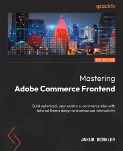

# Mastering Adobe Commerce Frontend

Welcome to the official repository for "Mastering Adobe Commerce Frontend". This repository serves as a comprehensive resource, containing code examples and solutions to practical exercises aligned with the content of each chapter in the book. The book is designed to guide you through setting up your local environment, understanding the intricacies of Adobe Commerce theming, and mastering frontend optimization techniques, among other essential topics.

## Repository Structure

The repository is organized into folders corresponding to the chapters in the book. Each chapter folder is further divided into `code` and `solutions` subfolders.

- **`code` folders**: Contain code examples discussed within each chapter. These examples illustrate the key concepts and techniques for Adobe Commerce frontend development.

- **`solutions` folders**: Contain the solutions to practical exercises provided at the end of each chapter. These solutions are intended to help you apply what you've learned and solidify your understanding of Adobe Commerce frontend development.

### Chapters Overview

1. Setting Up the Local Environment
2. Installing the Magento/Adobe Commerce Application
3. Introduction to Adobe Commerce Theming
4. The Layout System
5. Working with Templates
6. Styling an Adobe Commerce Theme
7. Customizing Emails
8. Introduction to JavaScript Libraries and Frameworks
9. RequireJS and jQuery
10. Knockout.js and UI Components
11. Commonly Used Libraries Bundled with Adobe Commerce
12. Storefront-Related Configuration in the Admin Panel
13. Working with Magento CMS
14. Frontend Optimization Techniques
15. Common Tools that Help with Local Development

## How to Use This Repository

- **For Learning**: Navigate through the `code` folders to find examples discussed in each chapter. Use these examples to understand the practical application of concepts.

- **For Practice**: After working through the chapters, attempt the practical exercises and then check your solutions against those provided in the `solutions` folders.

I hope this repository enhances your learning experience and aids you in mastering Adobe Commerce frontend development. Happy coding!

Jakub Winkler
